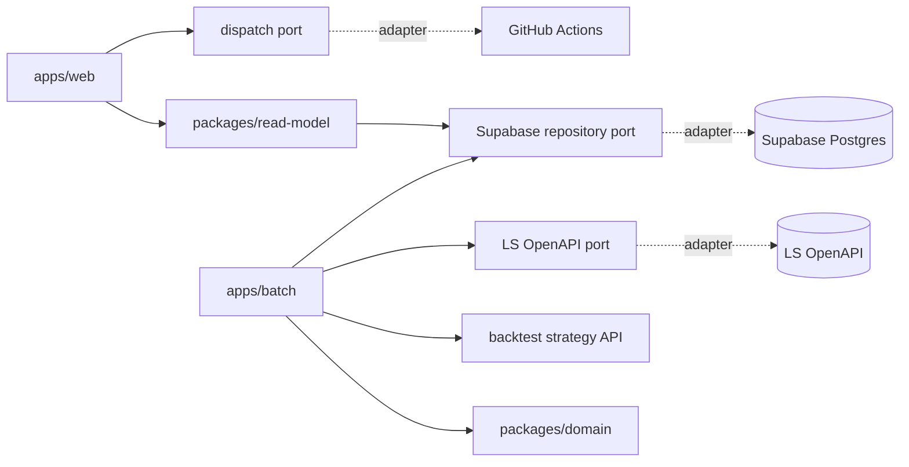
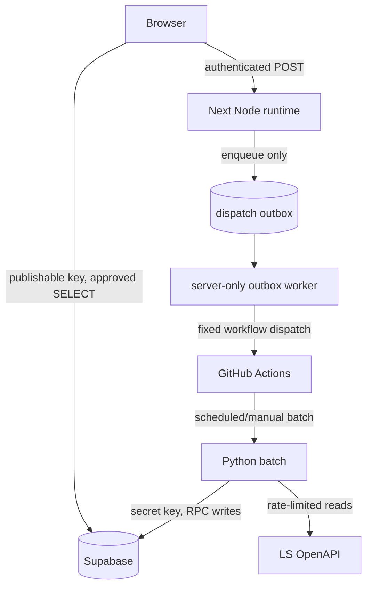

# Architecture Spine — wave-double V1

이 문서는 구현 단위가 독립적으로 개발되어도 달라지면 안 되는 규칙만 고정한다. `AD-*`는 binding invariant, Stack과 Structural Seed는 첫 구현의 cold-start 기준, Deferred는 명시된 재검토 조건이 오기 전까지 구현자가 임의로 결정하지 않을 항목이다. 상세 테이블 열과 운영 절차는 이 불변식을 만족하는 범위에서 코드·migration·runbook이 소유한다.

## Design Paradigm

**Hexagonal modular monolith + staged batch pipeline.** `apps/web`과 `apps/batch`는 입력 어댑터이고, LS OpenAPI·Supabase·GitHub는 출력 어댑터다. 전략·outcome·성과 산식은 프레임워크를 모르는 도메인 경계 안에 둔다.



의존 방향은 바깥에서 안쪽으로만 흐른다. 도메인과 전략 커널은 Next.js, Supabase SDK, GitHub SDK, LS HTTP 형식을 import하지 않는다.

## Capability → Architecture Map

| Capability / Area | Lives in | Governed by |
| --- | --- | --- |
| CAP-1 후보 모집단 | screen stage, LS adapter, `candidates` | AD-2/3/4/6/12/13/16 |
| CAP-2 전략 태깅 | `backtest.strategy_api`, tagging stage, `candidate_tags`, OHLCV cache | AD-1/2/5/16/20 |
| CAP-3 3일 수급 | supply stage, `supply_3day` | AD-2/4/6/10/13 |
| CAP-4 시장 수급 | market stage, `market_supply` | AD-2/4/6/13 |
| CAP-5 자동·수동 실행 | trusted workflows, protected dispatch route, run state, outbox | AD-3/7/10/11/18/20 |
| CAP-6 수급 힌트 | domain rule, SQL read view, candidate UI | AD-4/8/13 |
| CAP-7 사후 추적·검증 | outcome ledger/projection, bias stage, metrics views | AD-8/9/12/15/16/19/20/21 |
| UX 상태·신선도 | Next routes `/`, `/tracking`, `/runs` | AD-8/10/13 |

## Stack & Structural Seed

다음 조합은 2026-09-01 공식 지원 상태를 확인한 cold-start seed다. 첫 lockfile은 아래 exact version으로 생성하고 기존 `backtest` 전체 테스트와 AD-5 golden parity를 통과해야 한다. 실패하면 구현자가 임의로 낮추지 않고 이 spine을 갱신한다.

| Name | Version |
| --- | --- |
| Python | 3.12.14 |
| pandas | 3.0.5 |
| NumPy | 2.5.2 |
| HTTPX | 0.28.1 |
| PyArrow | 25.0.1 |
| Node.js | 24.20.0 LTS |
| Next.js | 16.3.3 (2026-08-26 security release) |
| React / react-dom | 19.2.8 |
| TypeScript | 5.9.3 |
| `@supabase/supabase-js` | 2.112.4 |
| `@supabase/ssr` | 0.12.4 |
| Playwright | 1.62.1 |
| Supabase Postgres | provider-managed; provision acceptance test로 기능 확인 |
| GitHub Actions runner | `ubuntu-24.04` |

```text
pyproject.toml                # Python direct dependency authority
uv.lock                       # Python exact transitive lock
package.json                  # npm workspaces
package-lock.json             # JavaScript exact transitive lock
apps/
  web/                        # Next App Router, read UI, protected routes
  batch/                      # Python CLI and staged orchestrator
packages/
  domain/                     # outcome, hint, calendar, run-state rules
  read-model/                 # generated DB types and query contracts
backtest/                     # adopted strategy/metric kernel
infra/supabase/migrations/    # schema, RLS, views, RPCs
.github/workflows/            # test, schedule, dispatch, backup, restore drill
tests/fixtures/               # golden signals, SQL parity, LS samples
```



## Invariants & Rules

### AD-1 — 런타임 간 계약은 포트와 저장 모델이다 [ADOPTED]

- **Binds:** CAP-1~7, 모든 구현 단위
- **Prevents:** 웹·배치·백테스트가 서로의 프레임워크나 내부 모듈을 직접 호출하는 것
- **Rule:** `apps/*`만 외부 I/O와 프레임워크를 소유한다. `packages/domain`과 `backtest`는 순수 Python/TypeScript 계약만 노출한다. Python과 TypeScript 사이의 공유 계약은 versioned SQL schema, RPC payload, generated read-model types로 한정한다.

### AD-2 — Supabase가 운영 공유 데이터의 단일 소유자다 [ADOPTED]

- **Binds:** CAP-1~7, 모든 운영 테이블
- **Prevents:** 웹 캐시·배치 파일·DB가 같은 사실을 서로 다르게 보유하는 것
- **Rule:** 운영 사실은 Supabase Postgres에 한 번만 저장한다. 모든 배치 파생행은 `attempt_run_id` lineage를 가지며, 웹은 승인된 view/RPC만 읽는다. schema 변경은 AD-14의 migration 경로로만 수행한다. 파일과 GitHub artifact는 백업·검증 산출물이며 운영 사실의 권위가 아니다.

### AD-3 — 배치는 lease·fence를 가진 멱등 상태 머신이다

- **Binds:** CAP-1~5/7, NFR-2/3/5/7/8
- **Prevents:** 중첩 실행, stale worker, 재시도가 서로의 stage와 pointer를 덮는 것
- **Rule:** close/premarket 논리 키는 `(trading_day, batch_kind, final)`, intraday는 `(trading_day, batch_kind, KST 30-minute slot)`이다. `logical_runs`는 현재 실행권자인 `active_attempt_run_id`와 출판 결과인 `canonical_success_run_id`, `current_complete_run_id`, `latest_partial_run_id`를 분리한다. `start_attempt` RPC가 logical row를 잠그고 새 UUID `run_id`, 증가하는 `attempt_no`와 `fence_token`, lease를 발급하며 이전 active attempt를 `superseded`로 종결한다. 이력 행은 삭제하지 않는다.

  상태는 `running → ready_to_publish → published` 또는 `partial | failed | skipped | superseded | cancelled`로만 전이한다. stage writer는 `(run_id, stage, fence_token, lease_token, expected_status)`를 받는 전용 RPC로 자신이 소유한 결과만 idempotent upsert한다. heartbeat가 만료된 attempt는 reaper가 완료된 필수 stage가 하나라도 있으면 `ready_to_publish`, 하나도 없으면 `failed`로 CAS 처리한다(단, 이미 다른 attempt가 같은 logical key를 `active`로 잡았으면 무조건 `failed`). GitHub `concurrency.group`은 `wave-double-${{ inputs.logical_run_key }}`를 사용하지만 DB fence가 최종 권위다.

### AD-4 — 거래 시간 의미론은 하나뿐이다 [ADOPTED]

- **Binds:** CAP-1~7, NFR-8/9
- **Prevents:** UTC/KST·달력일/거래일·장중/종가 데이터가 섞이는 것
- **Rule:** 저장/API instant는 UTC `timestamptz`, 거래일과 표시는 `Asia/Seoul`을 쓴다. `trading_calendar`가 D-2/D-1/D0와 보유일을 소유한다. calendar 조회 실패는 휴장일이 아니라 `CALENDAR_UNAVAILABLE` 실패다. close 배치만 outcome을 확정하며, 종목별 당일 수급이 전부 0이면 재시도 후 미해결 종목 수를 가진 `partial`로 끝낸다.

### AD-5 — 운영과 백테스트는 하나의 전략 API를 공유한다 [ADOPTED]

- **Binds:** CAP-2/7, NFR-6, 전략 A/B/C/D/E/F
- **Prevents:** 운영 수식이 백테스트와 따로 진화하거나 신규 종목 하나가 전체 tagging을 막는 것
- **Rule:** `backtest.strategy_api.compute_abc(frame) -> StrategyResult`가 유일한 전략 entrypoint다. 기존 indicator/engine을 내부에서 재사용하되 exception과 비유한 입력을 typed error로 반환하며 무신호로 숨기지 않는다. backtest CLI와 운영 tagging이 모두 이 API를 호출한다. 동일 일봉에서 TP와 SL을 모두 통과하면 기존 `backtest.engine`과 같이 SL을 우선한다.

  **Addendum (2026-09-04 Correct Course, Epic 6):** 전략 D(돌파3%기법)·E(익절2%_고정SL5%기법) 추가 시 함수명 `compute_abc`는 하위호환을 위해 유지하되, 반환하는 `StrategyResult`가 A/B/C/D/E 5개 시그널 키를 모두 포함하도록 확장한다. D/E는 각각 고유한 청산조건(TP/SL/최대보유)을 가지므로, `StrategyResult`는 시그널 종목 집합뿐 아니라 전략별 청산 파라미터도 함께 노출해 Epic 3 outcome 적재가 전략마다 올바른 TP/SL을 적용할 수 있게 한다.

  **Addendum 2 (2026-09-07 Correct Course, Epic 7):** 전략 F(각도 가속·이평선 쌍바닥 기법) 추가 시 `StrategyResult`가 A/B/C/D/E/F 6개 시그널 키를 모두 포함하도록 확장한다. F는 고유 청산조건(TP3%/SL4%/최대보유 없음)을 가지므로, Addendum(2026-09-04)이 도입한 전략별 청산 파라미터 노출 구조에 F 항목을 추가하는 것으로 족하다(신규 구조 도입 불필요).

  `ohlcv_cache`는 종목별로 `READY | INELIGIBLE_INSUFFICIENT_HISTORY | ERROR`를 반환한다. 정상적인 120거래일 미만은 해당 종목만 제외하고, API/저장 실패만 retryable stage error다. 기존 종목은 마지막 저장 거래일 다음부터 cutoff까지 모든 누락일을 채우고 corporate-action adjustment version 변경 시 영향 구간을 재구축한다. golden fixture는 비어 있지 않아야 하며 전략별 Jaccard가 0.9 미만이거나 typed error가 있으면 배포를 막는다. 이 게이트는 backtest(yfinance 배당조정)와 운영(LS `t8410`/`t8451`의 `sujung` 플래그, 액면분할 위주)의 조정 방식론이 신호 재현에 무시할 수 있는 수준으로 동등함을 별도 조정-방식론 동등성 검증(단발성)으로 확인한 뒤에만 유효하며, 미검증 상태에서는 Jaccard 통과를 신뢰하지 않는다.

### AD-6 — LS API 예산과 canonical 후보 집합은 공통 client가 소유한다 [ADOPTED]

- **Binds:** CAP-1~4/7, NFR-2/3/7
- **Prevents:** 단계별 독자 재시도와 비결정적 절단이 30분 예산이나 재현성을 깨는 것
- **Rule:** 모든 LS 호출은 단일 adapter의 TR별 token bucket, bounded retry, 남은 wall-clock budget을 거친다. `Retry-After`의 delta-seconds/HTTP-date 또는 reset timestamp를 파싱하고 비정상 값은 bounded default backoff로 대체한다. 예산이나 최대 시도 소진은 `RATE_LIMIT_EXHAUSTED`, `partial`, `unprocessed_count`로 종결한다. 교차 TR 병렬화는 Deferred 조건을 충족하기 전 금지한다.

  screen은 source별 결과를 종목코드로 합치고 동일 종목의 거래대금 불일치를 source 우선순위 `t1859 > t1852 > t1856`과 최대 유효 거래대금으로 정규화한다. 거래대금이 null/비유한이면 후보에서 제외하고 result code를 기록한다. 150개 초과 시 거래대금 내림차순, 종목코드 오름차순으로 상위 150개를 선택한다. 같은 canonical input artifact에는 같은 후보 집합과 hash가 나와야 한다.

### AD-7 — 브라우저는 단일 운영자 세션과 읽기 권한만 가진다

- **Binds:** CAP-5, NFR-1/5, 데이터 거버넌스
- **Prevents:** public repository·브라우저에서 elevated secret이 노출되거나 비인가 사용자가 배치를 실행하는 것
- **Rule:** V1은 외부 사용자 관리 없이 Supabase Auth 이메일/비밀번호(Supabase 대시보드에 사전 등록한 단일 슈퍼유저 계정, 공개 회원가입 비활성화)로 단일 운영자 세션만 발급한다. server-side subject allowlist가 dispatch 권한의 권위다. 브라우저에는 publishable key와 RLS가 허용한 `SELECT`만 둔다. Supabase secret, LS token, GitHub token은 trusted workflow 또는 server-only 환경에만 둔다. dispatch route는 JWKS signature/issuer/audience/expiry/sub, SameSite=Strict double-submit CSRF, 사용자 rate limit, AD-18 idempotency를 모두 검증한다. owner/repo/workflow/ref는 고정값이며 사용자 입력을 받지 않는다.

### AD-8 — 금융 지표는 versioned read model에서 계산한다

- **Binds:** CAP-6/7, FR-7/9/10
- **Prevents:** Python과 UI가 승률·PF·표본 게이트를 다르게 계산하는 것
- **Rule:** 수급 3상태, 승률, PF, 종결/진행중 수, 95% 신뢰구간, 표본 30건 게이트는 versioned SQL view/RPC가 반환한다. UI는 계산하지 않는다. 동일 fixture의 Python 기준값과 SQL 결과 동등성 테스트가 migration gate다.

### AD-9 — Outcome은 append-only event 장부와 재생 가능한 projection이다 [ADOPTED]

- **Binds:** CAP-7, NFR-5/6/9, FR-8
- **Prevents:** 재실행이 과거 결과를 삭제·변경하거나 동일 종목·전략에 중복 OPEN을 만드는 것
- **Rule:** `outcome_events`와 `outcome_observations`는 append-only이고, `candidate_outcome`은 재구축 가능한 current projection이다. AD-20의 canonical close publication만 idempotent command key `(logical_run_key, ticker, strategy, command_type)`로 event를 append한다. 동일 `(ticker, strategy)`의 `OPEN`은 partial unique index로 최대 1개다. observation identity는 `(outcome_id, evaluation_trading_day)`이며 retry는 기존 observation을 반환한다. terminal `TP | SL | TIMEOUT`은 불변이다. `SUSPENDED` 복귀/종결과 수치 수정은 expected version을 가진 `outcome_correction` event만 허용한다. ledger와 projection은 AD-19 cleanup 대상이 아니다.

### AD-10 — 운영 가시성은 `run_id` 중심이다

- **Binds:** CAP-1~7, SM-1/2
- **Prevents:** 후보 없음, 실패, 정상 0, 미수집, stale 결과를 구분하지 못하는 것
- **Rule:** 모든 구조화 로그와 stage result는 `run_id`, `stage`, `batch_kind`, `trading_day`, `attempt_no`, `duration_ms`, `result_code`를 가진다. secret·authorization header·민감 payload는 로그 금지다. 첫 출판 전 실패는 `NO_SNAPSHOT`, lease 만료는 `ORPHANED_ATTEMPT`, 절단은 `truncated_count`로 노출한다.
- **알림 계약(2026-09-01 결정):** V1 운영 조회는 **기본 pull-only**다 — 일상 상태(배치 실패·부분성공·stale·폴백·표본 부족)는 Neo가 대시보드 `/runs`·Data trust bar에서 확인한다(AD-13/FR-6a). 능동 통지(push)는 **P1급 또는 사람의 수신 확인이 필요한 클래스만** GitHub-native Issue로 발사한다: SM-1의 P1(종가 확정 배치 연속 2거래일 실패), 가격 보정 이상(SUSPENDED) 감지(Story 3.5), 상장폐지(DELISTED) 감지(Story 3.9), 백업 실패(AD-17). GitHub이 이미 운영 플랫폼이므로 제3자(무료/유료) 신규 의존을 추가하지 않는다(NFR-1). SUSPENDED/DELISTED Issue는 "필요 조치" 상태로 남고 correction event로 해소 시 close된다. 이 항목은 재검토 조건이 오기 전까지 임의로 push 채널(이메일·Slack 등)을 늘리지 않는다(Deferred 보완).

### AD-11 — 개발과 운영의 데이터 경계를 분리한다

- **Binds:** 모든 구현·배포 단위, public repository
- **Prevents:** PR·로컬 테스트가 운영 DB를 변형하거나 fork workflow가 production secret을 받는 것
- **Rule:** 로컬/CI는 fixture와 local test DB만 사용한다. production migration, 배치, 백업은 default branch의 trusted workflow만 수행하며 PR·fork workflow에는 production secret을 주지 않는다. runner preinstall에 의존하지 않고 lockfile과 setup action으로 런타임을 고정한다.

### AD-12 — 후보 상한과 편향은 같은 결정에서 기록한다 [ADOPTED]

- **Binds:** CAP-1/7, FR-1/10, NFR-7
- **Prevents:** 처리 상한이 조용한 기회 누락이 되는 것
- **Rule:** AD-6이 선택한 canonical 후보 집합의 원본 수, 제외 수, selection input hash를 run에 기록한다. close publication은 백테스트 유니버스 시그널과 후보 시그널의 교집합·차집합·절단 포함 기회 누락을 logical day/source별 append-only bias event로 저장한다. 임의 거래일 조회는 canonical view로 과거 event를 보존한다.

### AD-13 — 완전 스냅샷은 원자적으로 공개하고 partial은 분리해 읽는다

- **Binds:** CAP-1~7, FR-6a, NFR-5
- **Prevents:** 서로 다른 run의 row가 한 화면 section에서 섞이거나 partial이 정상 pointer를 낮추는 것
- **Rule:** stage row는 unpublished `run_id` 아래 기록한다. AD-20의 publication transaction만 `current_complete_run_id`를 갱신한다. partial은 `latest_partial_run_id`에 기록하며 complete pointer를 바꾸지 않는다. `get_dashboard_snapshot()`은 `complete_snapshot`, `latest_attempt`, `available_partial_sections`, `missing_sections`, `unprocessed_items`, `no_snapshot`을 분리 반환한다. section의 고정 taxonomy는 `candidates`(CAP-1/6), `tags`(CAP-2), `supply_3day`(CAP-3), `market_supply`(CAP-4), `outcome_tracking`(CAP-7)이며 새 section 추가는 이 spine의 갱신을 요구한다. section 하나는 오직 하나의 `run_id`에서 읽으며 UI는 각 section의 run/time/status를 표시한다.

### AD-14 — DB 계약은 forward-only expand-migrate-contract로 진화한다

- **Binds:** AD-1/2/8/11, 웹·배치 독립 배포
- **Prevents:** migration 직후 N/N-1 consumer가 깨지거나 실행할 수 없는 rollback 계약에 의존하는 것
- **Rule:** Supabase CLI의 단일 timestamp SQL migration을 권위로 사용한다. 변경은 add/expand → backfill/dual-read → consumer 전환 → 다음 release의 contract 순서다. CI는 clean `db reset`, N/N-1 compatibility, generated types, SQL fixture parity를 검증한다. 운영 rollback은 destructive down migration이 아니라 앱 rollback + forward-fix이며, 데이터 복구는 AD-17의 검증된 backup만 사용한다.

### AD-15 — 한 logical run의 canonical winner는 한 번만 확정된다

- **Binds:** AD-3/9/12/13/20, CAP-2/7
- **Prevents:** partial·stale attempt가 outcome이나 provenance를 선점하고 출판 후 재시도가 과거 결과를 교체하는 것
- **Rule:** `active_attempt_run_id`이면서 올바른 fence를 가진 `ready_to_publish` attempt만 AD-20 transaction의 후보가 된다. `canonical_success_run_id`는 `batch_kind='close'`인 logical run에만 존재하고 기록된다; premarket/intraday logical run은 outcome을 생성하지 않으므로 이 컬럼을 항상 NULL로 두며 provenance/outcome join은 `batch_kind='close'` 조건을 함께 검사한다. 출판된 close logical key의 `canonical_success_run_id`는 불변이며 같은 key의 요청은 기존 결과를 replay한다. 운영 사실을 다시 계산해야 하면 별도 `logical_revision`과 감사 사유를 생성하고 기존 ledger를 수정하지 않는다.

### AD-16 — Source provenance는 정규화된 contribution 행으로 흐른다

- **Binds:** CAP-1/2/7, AD-8/9/12/15/21
- **Prevents:** fallback source가 태깅·outcome·지표에서 소실되거나 JSON과 행 모델이 다르게 집계되는 것
- **Rule:** `candidate_id`는 attempt마다 새로 발급되는 attempt-scoped identity다(같은 종목이 다른 attempt에서 재선정되면 새 `candidate_id`를 받는다); logical run을 가로지르는 안정 식별자가 아니므로 cross-attempt 조인은 `(ticker, strategy, attempt_run_id)`로 한다. `candidate_source_contrib(candidate_id, attempt_run_id, source, contribution_weight)`가 source별 기여를 표현한다. PK는 `(candidate_id, attempt_run_id, source)`, `source`는 `t1859 | t1852 | t1856`, weight는 `(0,1]`이다. AD-20 RPC가 published candidate마다 한 행 이상, weight 합계 1을 검증한다. primary source는 weight 내림차순 후 위 source 우선순위로 도출한다. `source_jsonb`는 필요 시 이 테이블에서 만드는 read projection이며 저장하지 않는다.

### AD-17 — 무료 운영은 암호화 dump와 검증된 복원으로 보호한다

- **Binds:** AD-11/14, 모든 운영 테이블, NFR-1/4/5/9
- **Prevents:** 무료 Supabase에 없는 PITR을 가정하거나 복원 불가능한 백업을 성공으로 간주하는 것
- **Rule:** 유료 PITR과 DB 내부 `restore_epoch`에 의존하지 않는다. default branch의 trusted backup workflow가 6시간마다 transaction-consistent `pg_dump`를 만들고 `age` 공개키로 암호화해 GitHub Actions artifact에 14일 보관한다. backup job은 manifest에 schema migration version, cutoff, checksum을 남기고 실패를 알린다. 분기마다 disposable local PostgreSQL에 최신 backup을 복원해 migration/read-model/smoke test와 포인터 정합을 검증한다. 목표는 RPO 6시간, RTO 8시간이다. artifact quota·retention·restore test가 이 목표를 충족하지 못하면 production release를 차단하고 백업 저장소 변경을 별도 AD로 결정한다.

  운영 correction은 원행 UPDATE가 아니라 AD-9의 versioned event다. 대량 오염 복구는 schedule 정지 → backup 선택/검증 → restore → canonical pointer 검증 → schedule 재개의 fenced runbook을 따른다.

### AD-18 — Dispatch는 DB 요청 ID와 transactional outbox로 멱등화한다

- **Binds:** AD-3/7, CAP-5
- **Prevents:** DB/GitHub dual-write gap, 204 응답 뒤의 불명 상태, worker 중복 발송
- **Rule:** route는 bounded idempotency key와 canonical payload hash를 검증하고 하나의 DB RPC로 `dispatch_request`와 `dispatch_outbox`를 함께 생성한다. 같은 key+hash는 자체 `dispatch_request_id`를 replay하고 같은 key+다른 hash는 `409`다. outbox worker만 GitHub workflow dispatch를 호출하며 request ID와 logical key를 workflow input으로 보낸다. workflow 첫 단계는 같은 request ID로 receipt와 batch `run_id`를 idempotent 기록한다.

  worker는 `FOR UPDATE SKIP LOCKED`와 만료되는 lease로 행을 claim한다. 상태는 `queued → accepted → started → completed | failed | dead_letter`; 응답 유실 시 receipt를 먼저 조회하고 확인 전에는 재발송하지 않는다. GitHub가 dispatch를 수락했지만 workflow 첫 단계 receipt가 아직 없는 창(`accepted`이고 lease 만료)에서는 재발송 대신 outbox 행을 `accepted`에 유지한 채 receipt 폴링만 재시도하며, receipt가 일정 시간 내 나타나지 않을 때만 `dead_letter`로 전이해 사람이 GitHub run 목록을 대조한 뒤 수동 재개한다. Database Webhook은 wake-up hint일 뿐이고, Supabase `pg_cron` 1분 scan이 durable fallback이다. unresolved key는 TTL로 재사용하지 않는다.

### AD-19 — Non-canonical attempt는 보존하되 canonical view에서 제외한다

- **Binds:** AD-9/12/15/16/20/21
- **Prevents:** retry가 장기 이력을 삭제하거나 partial provenance가 성과 지표에 섞이는 것
- **Rule:** attempt-scoped `candidates`, `candidate_tags`, contribution, bias draft, stage 행은 `attempt_run_id`와 terminal status를 보존한다. 재시도나 publication은 이력을 삭제하지 않는다. canonical views는 `logical_runs.canonical_success_run_id`와 join해 published attempt만 노출한다. 장기 outcome/bias event는 append-only이며 재처리의 무효화는 삭제가 아니라 supersession/correction event로 표현한다.

### AD-20 — Publication 권한은 orchestrator의 단일 transaction에만 있다

- **Binds:** AD-3/9/13/15/16/19, close/premarket/intraday 출판
- **Prevents:** outcome-before-publish 순환 의존과 외부 publisher의 pointer 경쟁
- **Rule:** orchestrator만 `publish_attempt(run_id, fence_token)` RPC를 호출한다. serializable transaction은 logical row를 잠그고 active/fence/lease, batch kind, pre-publish 필수 stage를 검증한다. close는 같은 transaction 안에서 canonical 후보를 잠근 뒤 outcome command/event와 `outcome` stage를 생성한다. 이어 provenance cardinality/weight, 필수 stage 성공을 검증하고 canonical/current pointer, `published_at`, attempt `published` 상태를 함께 commit한다. 어느 단계든 실패하면 전부 rollback한다. observer, reconciler, 수동 SQL은 publish할 수 없다.

### AD-21 — Source별 지표의 유일한 권위는 `candidate_source_contrib`다

- **Binds:** AD-8/9/12/16/19, 모든 `*_by_source` view
- **Prevents:** `candidate_outcome.source`, JSONB, contribution 행이 서로 다른 source slice를 만드는 것
- **Rule:** 모든 source별 bias/승률/PF view는 canonical published candidate의 `candidate_source_contrib`만 join한다. outcome과 bias 테이블에 독립 source 사본을 두지 않는다. 기존 `candidate_outcome.source` 또는 `source_jsonb`가 생기면 migration으로 contribution을 backfill·검증한 뒤 제거한다.

## Consistency Conventions

| Concern | Convention |
| --- | --- |
| Python | 모듈·함수·필드 `snake_case`, 클래스 `PascalCase`, domain은 I/O 금지 |
| TypeScript | 컴포넌트·타입 `PascalCase`, 함수·변수 `camelCase`, route segment `kebab-case` |
| Database | table/column/view `snake_case`; migration `YYYYMMDDHHMM_description.sql`; 운영 직접 수정 금지 |
| IDs | 내부 PK UUID; 종목코드 6자리 문자열; 전략 `A | B | C` |
| Time | instant UTC `timestamptz`, 거래일 SQL `date`, 표시는 KST |
| Money & rates | DB `numeric`, API decimal string; float는 전략 계산 경계 안에서만 사용 |
| Missing data | `null + result_code`; 미수집·미확정·실제 0을 서로 대체하지 않음 |
| Errors | `result_code`, 안전한 `message`, `retryable`, `unprocessed_count`; UI 문구는 별도 mapping |
| Config | 앱 시작 시 schema 검증; secret은 `NEXT_PUBLIC_*` 금지; workflow input allowlist |
| Tests | domain unit → adapter contract → SQL parity → batch integration → Playwright E2E |

## Deferred

- ~~**Next.js 호스팅 제공자:** server-only Node 24 Route Handler, secret env, TLS, 무료 운영, 한국 리전 또는 허용 가능한 latency를 지원해야 한다. 배포 story에서 공식 한도와 contract smoke test를 확인한 뒤 선택한다.~~ **→ 해결됨 (결정, 2026-09-01): Vercel Hobby.**
- **배포(hosting) 결정(2026-09-01):** 웹 배포 제공자는 **Vercel Hobby(무료)** 로 고정한다. 근거: ① Next.js의 홈 플랫폼이라 Route Handler가 **Node.js runtime에서 완전 지원**(API Coverage full Node.js, secret env runtime 노출, 자동 TLS) ② $0 무료·개인 비영리 용도 — 이 도구의 1인 개인 운영과 정합(NFR-1 유료 의존 없음) ③ Hobby 한도(2026 기준 대역폭 100GB, 함수 호출 ~100K~1M, 빌드 6,000분, 함수 10초 time-out)가 1인 운영 대시보드 사용량을 압도적으로 상회 ④ 커스텀 도메인 + 리전 배치로 허용 가능한 latency ⑤ 웹·배치 독립 배포 토폴로지(AD-11)에서 가장 낮은 분기 위험. **남은 유일 사항(구현 단계 검증이지 Deferred 아님):** Story 1.11 AC1의 contract smoke test(실제 배포·한도 근접 영향의 신선도 표시 비혼동)는 구현 시 수행한다. 호스팅 재검토 트리거: Hobby의 비영리 제약에 걸리거나(V2 자동매매 상용화), 함수 호출/대역폭이 지속적 한도 근접을 보이면 그때 별도 결정.
- **ATR(14) 유효성 게이트 제거:** V1은 baseline 정합을 위해 유지한다. 제거는 A/B/C baseline 전체 재산출을 승인하는 별도 변경에서만 다룬다.
- **TR 간 교차 병렬화:** 기본은 TR별 1건/초다. 동일 계정의 제한 공유 여부와 429 동작을 production secret 없이 실측한 뒤에만 활성화한다.
- **장중 snapshot 보존 기간:** 초기값 90일이다. 30일간 용량 추세를 측정하고 500MB의 70% 도달 예상일이 180일 이내일 때 조정한다. `daily_ohlcv`, outcome/bias event, run audit는 정리 대상이 아니다.
- **Python data stack 승격:** Stack의 최신 조합은 첫 compatibility spike에서 전체 backtest와 golden fixture로 검증한다. 불합격이면 실패 패키지와 증거를 기록하고 지원 중인 최소 호환 조합으로 이 spine을 갱신한다.
